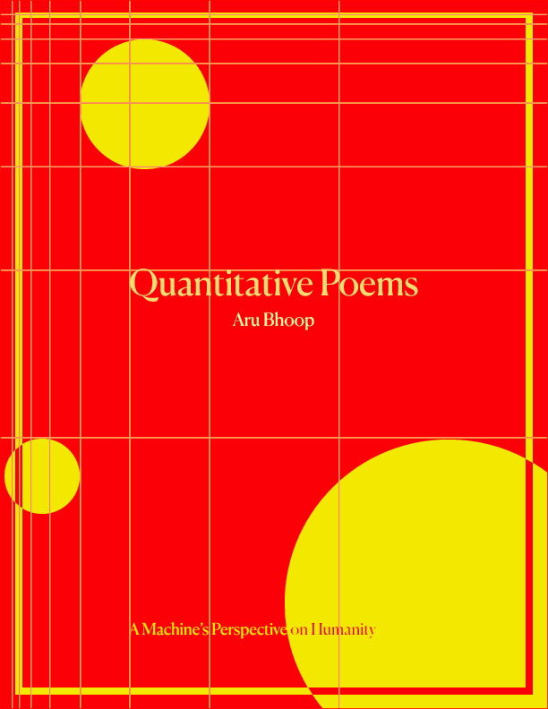

# Quantitative Poems

## Overview

This book is a quantitative exploration of the human experience through equations generated by artificial intelligence. It's still a work in progress, and I need to improve the equation generation algorithm, but wanted to share the proof-of-concept.

📚 **Read Online**: [here](https://aru.ai/quantitative-poems).

📙 **Purchase it on Amazon**: [Amazon](<https://www.amazon.com/Quantitative-Poems-Machines-Perspective-Quantified-ebook/dp/B0CW1BT5HY/>) (Paperback coming soon!).



## Background

[todo]

## Generating the book

If you're interested (and have lots of spare OpenAI credits), you can generate the book yourself.

### Prerequisites

Ensure you have the following tools installed:

-   **Pipenv**: A tool for managing Python packages. [Install from here](https://pipenv.pypa.io/en/latest/).
-   **Lualatex**: A typesetting system. [Learn more](https://www.luatex.org/).

Additionally, you will need an OpenAI API Key. Set `OPENAI_API_KEY` in your environment variables to authenticate your requests.

### Tutorial

1.  **Clone repository**: Clone the project's repository to your local machine. Replace <repo-url> with the actual URL of the repository.
```
git pull <repo-url>
```
2.  **Install dependencies**: Navigate to the project directory and install the necessary dependencies using Pipenv.
```
cd quantitative-poems
pipenv install
```
3.  **Create layout**: Generate the layout for the book.
```
pipenv run run_make_layout
```
4.  **Create equations**: Create equations (or "poems").
> [!NOTE]  
> This will use your OpenAI credits.
```
pipenv run run_equations
```
5.  **Generate book**: Compile the equations and layout into a pdf.
```
pipenv run gen_book
```

## Contributions

Contributions are welcome! If you're interested, please open an issue with your proposed changes!
