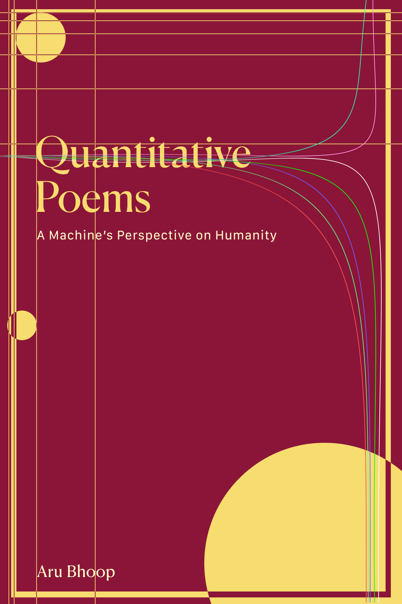

# Quantitative Poems

## Overview

Quantitative Poems is an exploration of the human condition through poetry, mathematics, and artificial intelligence. It contains equations ("poems") generated by artificial intelligence on themes such as discovery, love, and nature. It's still a work in progress, and I need to improve the generation algorithm, but I wanted to share what I have so far!

**Read Online**: [Quantitative Poems](https://aru.ai/quantitative-poems).

**Purchase it**: [Amazon Link](<https://www.amazon.com/Quantitative-Poems-Machines-Perspective-Quantified-ebook/dp/B0CW1BT5HY/>) (Paperback coming soon!).



## Generating the book

If you're interested (and have lots of spare Anthropic credits), you can generate the book yourself.

### Prerequisites

Ensure you have the following tools installed:

-   **Pipenv**: A tool for managing Python packages. [Install from here](https://pipenv.pypa.io/en/latest/).
-   **Lualatex**: A typesetting system. [Learn more](https://www.luatex.org/).

### Usage

1.  **Clone repository**: Clone the project's repository to your local machine. Replace <repo-url> with the actual URL of the repository.
```
git pull <repo-url>
```
2.  **Install dependencies**: Navigate to the project directory and install the necessary dependencies using Pipenv.
```
cd quantitative-poems
pipenv install
```
3.  **Generate Book**: Run the `main book build` command to generate book.
```
pipenv run main book build
```

## Contributions

Contributions are welcome! If you're interested, please [open an issue](https://github.com/aru-py/quantitative-poems/issues/new) with your proposed changes!
